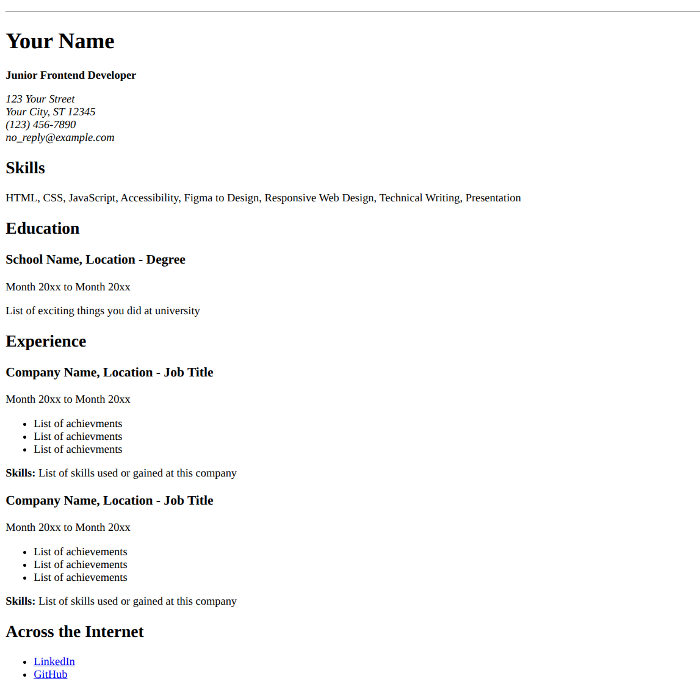

# Single-Page CV

This is my submission for the **Single-Page CV** challenge from [roadmap.sh](https://roadmap.sh/projects/single-page-cv). The focus of this project was to create a structured, professional-grade CV using strictly semantic HTML.

**[View Live Demo](https://anishniroula.github.io/frontend-challenges/roadmap-sh/single-page-cv/index.html)**

---

## Built With

- **HTML**

---

## Project Description

**Goal:**

The goal of this project is to teach you how to create a structured, single-page CV using only HTML. You will focus on laying out your education, skills, and career history in a clean, semantic manner. Styling will be addressed in a later project.

**Requirements:**

In this project, you are required to create a single-page CV (Curriculum Vitae) using only HTML. Your webpage should look like the following image: [Link to Image](https://assets.roadmap.sh/guest/resume-template-zyl70.png)

Key requirements for this project:

1. Semantic HTML: Use appropriate HTML tags to structure your CV.
2. SEO Meta Tags: Include essential meta tags for SEO.
3. Open Graph (OG) Tags: Add OG tags for better social media sharing.
4. Favicon: Add a favicon for your CV page.

The structure of your CV should be easily understandable and ready for styling in a future project.

**Submission Checklist**:

1. Semantically correct HTML structure.
2. Single-page layout with sections for education, skills, and career history.
3. Single-page layout with sections for education, skills, and career history.
4. OG tags for better social media sharing.
5. A favicon linked in the head section.

[project page URL](https://roadmap.sh/projects/single-page-cv)

---

## How to run locally

1. Clone the repo: `git clone https://github.com/anishniroula/frontend-challenges.git`
2. Navigate to the project: `cd roadmap-sh/single-page-cv`
3. Open `index.html` in your browser.

## Project Screenshots

